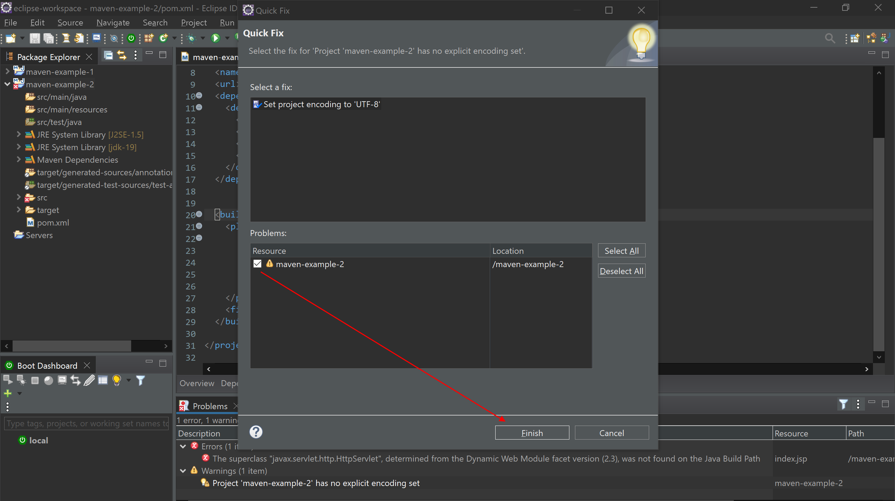
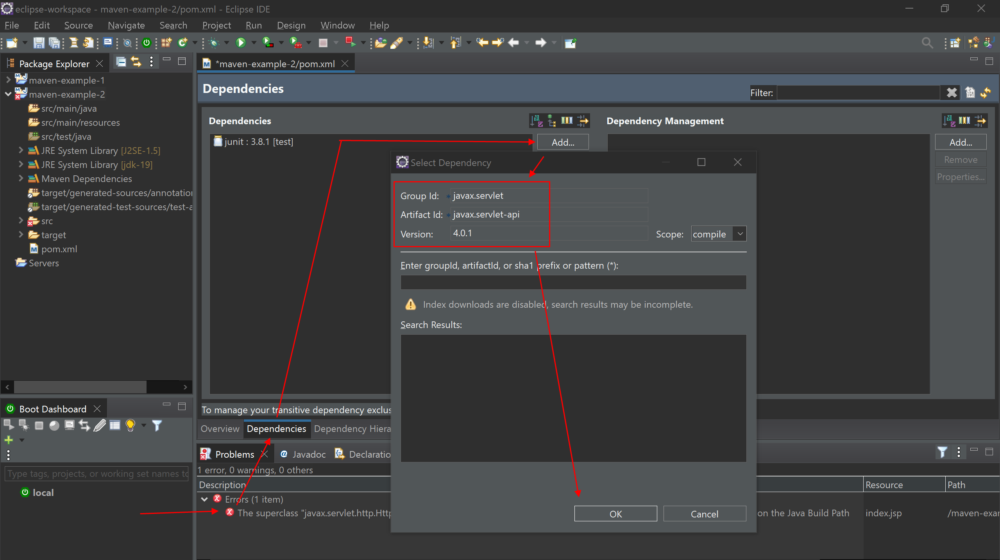

# Maven Example 2 - Hibernate JSP

# 0. Creación del proyecto, solución primeros errores y dependencias







```xml
<project xmlns="http://maven.apache.org/POM/4.0.0" xmlns:xsi="http://www.w3.org/2001/XMLSchema-instance"
  xsi:schemaLocation="http://maven.apache.org/POM/4.0.0 http://maven.apache.org/maven-v4_0_0.xsd">
  <modelVersion>4.0.0</modelVersion>
  <groupId>com.example-2</groupId>
  <artifactId>maven-example-2</artifactId>
  <packaging>war</packaging>
  <version>0.0.1-SNAPSHOT</version>
  <name>maven-example-2 Maven Webapp</name>
  <url>http://maven.apache.org</url>
  
  <properties>
    <project.build.sourceEncoding>UTF-8</project.build.sourceEncoding>
  </properties>
  
  <dependencies>
    <dependency>
      <groupId>junit</groupId>
      <artifactId>junit</artifactId>
      <version>3.8.1</version>
      <scope>test</scope>
    </dependency>
    
    <dependency>
    	<groupId>javax.servlet</groupId>
    	<artifactId>javax.servlet-api</artifactId>
    	<version>4.0.1</version>
    </dependency>
    
	<dependency>
	    <groupId>org.postgresql</groupId>
	    <artifactId>postgresql</artifactId>
	    <version>42.5.0</version>
	</dependency>
	
	<dependency>
	    <groupId>org.hibernate</groupId>
	    <artifactId>hibernate-core</artifactId>
	    <version>5.6.12.Final</version>
	</dependency>
		
	<dependency>
	    <groupId>org.hibernate</groupId>
	    <artifactId>hibernate-entitymanager</artifactId>
	    <version>5.6.12.Final</version>
	</dependency>
  </dependencies>
  
  <build>
  	<plugins>
        <plugin>
            <groupId>org.apache.maven.plugins</groupId>
            <artifactId>maven-war-plugin</artifactId>
            <version>3.3.1</version>
        </plugin>
    </plugins>
  
    <finalName>maven-example-2</finalName>
  </build>
</project>
```

# 1. Los modelos (con JPA)

## 1.1. *src/main/java --> Models.DTOs --> AlumnoDTO.java*

```java
package Models.DTOs;

import java.io.Serializable;
import java.util.HashSet;
import java.util.Set;

import javax.persistence.CascadeType;
import javax.persistence.Column;
import javax.persistence.Entity;
import javax.persistence.FetchType;
import javax.persistence.GeneratedValue;
import javax.persistence.GenerationType;
import javax.persistence.Id;
import javax.persistence.JoinTable;
import javax.persistence.JoinColumn;
import javax.persistence.ManyToMany;
import javax.persistence.Table;

//Entity defines which objects should be persisted in the database
@Entity
//Defines the name of the table created for the entity
@Table(name = "alumnos")
public class AlumnoDTO implements Serializable {
	
	private static final long serialVersionUID = 1L;
	
	/******************************* ATRIBUTOS *******************************/
	
	// All entities must define a primary key which you define with
	// the @Id annotation	
	// You can override the default column name 
	// Map id to the CustID field in the DB
	// You can have it auto generate
	// @GeneratedValue(strategy = GenerationType.AUTO)
	
	@Id
	@Column(name = "alumno_id", unique = true)
	@GeneratedValue(strategy = GenerationType.IDENTITY)
	int alumno_id;
	@Column(name = "alumno_nombre", length = 100, nullable = true)
	String alumno_nombre;
	@Column(name = "alumno_apellidos", length = 100, nullable = true)
	String alumno_apellidos;
	@Column(name = "alumno_email", length = 100, nullable = true)
	String alumno_email;
	
	//////////////////////////// para hacer la relación necesitamos esto //////////////////////////
	@ManyToMany(
		fetch = FetchType.LAZY,	
		cascade = {
	        CascadeType.PERSIST,
	        CascadeType.MERGE
	    })
    @JoinTable(name = "relAlumAsig", 
            joinColumns = { @JoinColumn(name = "alumno_id", nullable = false, updatable = false) }, 
            inverseJoinColumns = { @JoinColumn(name = "asignatura_id", nullable = false, updatable = false) })
    private Set<AsignaturaDTO> asignaturas = new HashSet<AsignaturaDTO>();

	public Set<AsignaturaDTO> getAsignaturas() {
		return asignaturas;
	}
	/////////////////////////////////////////////////////////////////////////////////////////////

	/******************************* CONSTRUCTORES ***********************************/
	
	// constructor lleno
	public AlumnoDTO(int alumno_id, String alumno_nombre, String alumno_apellidos, String alumno_email) {
		super();
		this.alumno_id = alumno_id;
		this.alumno_nombre = alumno_nombre;
		this.alumno_apellidos = alumno_apellidos;
		this.alumno_email = alumno_email;
	}
	
	// constructor vacío
	public AlumnoDTO() {
		super();
	}
		

	/******************************* GETTERS Y SETTERS **************************************/
	public int getAlumno_id() {
		return alumno_id;
	}
	public void setAlumno_id(int alumno_id) {
		this.alumno_id = alumno_id;
	}
	public String getAlumno_nombre() {
		return alumno_nombre;
	}
	public void setAlumno_nombre(String alumno_nombre) {
		this.alumno_nombre = alumno_nombre;
	}
	public String getAlumno_apellidos() {
		return alumno_apellidos;
	}
	public void setAlumno_apellidos(String alumno_apellidos) {
		this.alumno_apellidos = alumno_apellidos;
	}
	public String getAlumno_email() {
		return alumno_email;
	}
	public void setAlumno_email(String alumno_email) {
		this.alumno_email = alumno_email;
	}
		
		
	/*************************************** MÉTODOS *****************************************/
		
	public void addAsignatura(AsignaturaDTO asignatura) { // para hacer la relación
        this.asignaturas.add(asignatura);
        asignatura.getAlumnos().add(this);
    }
 
	public void removeAsignatura(int asignatura_id) { // para hacer la relación
	    AsignaturaDTO asignatura = this.asignaturas.stream().filter(a -> a.getAsignatura_id() == asignatura_id).findFirst().orElse(null);
	    if (asignatura != null) {
	      this.asignaturas.remove(asignatura);
	      asignatura.getAlumnos().remove(this);
	    }
	  }
		
	/*************************************** ToString ***************************************/
	@Override
	public String toString() {
	    return 
	    	"\t" + alumno_id + 
	    	"\t" + alumno_nombre +
	    	"\t" + alumno_apellidos +
	    	"\t" + alumno_email;
	}
}
```

## 1.2. *src/main/java --> Models.DTOs --> AsignaturaDTO.java*

```java
package Models.DTOs;

import java.io.Serializable;
import java.util.HashSet;
import java.util.Set;

import javax.persistence.CascadeType;
import javax.persistence.Column;
import javax.persistence.Entity;
import javax.persistence.FetchType;
import javax.persistence.GeneratedValue;
import javax.persistence.GenerationType;
import javax.persistence.Id;
import javax.persistence.ManyToMany;
import javax.persistence.Table;


//Entity defines which objects should be persisted in the database
@Entity
//Defines the name of the table created for the entity
@Table(name = "asignaturas")
public class AsignaturaDTO implements Serializable {
	
	private static final long serialVersionUID = 1L;
	
	/******************************* ATRIBUTOS *******************************/
	
	// All entities must define a primary key which you define with
	// the @Id annotation	
	// You can override the default column name 
	// Map id to the CustID field in the DB
	// You can have it auto generate
	// @GeneratedValue(strategy = GenerationType.AUTO)
	
	@Id
	@Column(name = "asignatura_id", unique = true)
	@GeneratedValue(strategy = GenerationType.IDENTITY)
	int asignatura_id;
	@Column(name = "asignatura_nombre", length = 100, nullable = true)
	String asignatura_nombre;
	
	//////////////////////////// para hacer la relación necesitamos esto //////////////////////////
	@ManyToMany(
		fetch = FetchType.LAZY,	
		cascade = {
			CascadeType.PERSIST,
		    CascadeType.MERGE
		},
		mappedBy = "asignaturas"
	)
	private Set<AlumnoDTO> alumnos = new HashSet<AlumnoDTO>();

	public Set<AlumnoDTO> getAlumnos() {
		return alumnos;
	}
	/////////////////////////////////////////////////////////////////////////////////////////////


	/******************************* CONSTRUCTORES ***********************************/
	
	// constructor lleno
	public AsignaturaDTO(int asignatura_id, String asignatura_nombre) {
		super();
		this.asignatura_id = asignatura_id;
		this.asignatura_nombre = asignatura_nombre;
	}
	
	// constructor vacío
	public AsignaturaDTO() {
		super();
	}
		

	/******************************* GETTERS Y SETTERS **************************************/
	public int getAsignatura_id() {
		return asignatura_id;
	}
	public void setAsignatura_id(int asignatura_id) {
		this.asignatura_id = asignatura_id;
	}
	public String getAsignatura_nombre() {
		return asignatura_nombre;
	}
	public void setAsignatura_nombre(String asignatura_nombre) {
		this.asignatura_nombre = asignatura_nombre;
	}
		
		
	/*************************************** MÉTODOS *****************************************/
	
		
	/*************************************** ToString ***************************************/
	@Override
	public String toString() {
	    return 
	    	"\t" + asignatura_id + 
	    	"\t" + asignatura_nombre;
	}
}
```

# 2. Configuraciones para la persistencia en la BBD

## 2.1. *src/main/resources --> META-INF --> persistence.xml*

```xml
<?xml version="1.0" encoding="UTF-8"?>

<!-- https://javabydeveloper.com/what-is-dialect-in-hibernate-and-list-of-dialects/ -->

<!-- 
2. This file defines classes you wish to persist. 
How these classes are mapped to database tables. 
Database driver, location, userid and pw
 -->
 
<persistence version="2.0"
    xmlns="http://java.sun.com/xml/ns/persistence" xmlns:xsi="http://www.w3.org/2001/XMLSchema-instance"
    xsi:schemaLocation="http://java.sun.com/xml/ns/persistence http://java.sun.com/xml/ns/persistence/persistence_2_0.xsd">
    
    <!-- Define a name used to get an entity manager. Define that you will complete transactions with the DB -->
    <persistence-unit name="ALUMNO_PERSISTENCE" transaction-type="RESOURCE_LOCAL">
    
        <!-- Define the class for Hibernate which implements JPA -->
        <provider>org.hibernate.jpa.HibernatePersistenceProvider</provider>
        <!-- Define the object that should be persisted in the database -->
        <class>Models.DTOs.AlumnoDTO</class>
        <properties>
            <!-- Driver for DB database -->
            <property name="javax.persistence.jdbc.driver" value="org.postgresql.Driver" />
            <!-- URL for DB -->
            <property name="javax.persistence.jdbc.url" value="jdbc:postgresql://localhost/postgres" />
            <!-- Username -->
            <property name="javax.persistence.jdbc.user" value="postgres" />
            <!-- Password -->
            <property name="javax.persistence.jdbc.password" value="12345" />
            
            <property name="hibernate.dialect" value="org.hibernate.dialect.PostgreSQLDialect"/>
            <property name="hibernate.hbm2ddl.auto" value="create" />
            <property name="show_sql" value="true"/>
            <property name="hibernate.temp.use_jdbc_metadata_defaults" value="false"/>
            <property name="hibernate.format_sql" value="true"/>
            <property name="hibernate.use_sql_comments" value="true"/>
        </properties>
    </persistence-unit>
    
    <!-- Define a name used to get an entity manager. Define that you will complete transactions with the DB -->
    <persistence-unit name="ASIGNATURA_PERSISTENCE" transaction-type="RESOURCE_LOCAL">
    
        <!-- Define the class for Hibernate which implements JPA -->
        <provider>org.hibernate.jpa.HibernatePersistenceProvider</provider>
        <!-- Define the object that should be persisted in the database -->
        <class>Models.DTOs.AsignaturaDTO</class>
        <properties>
            <!-- Driver for DB database -->
            <property name="javax.persistence.jdbc.driver" value="org.postgresql.Driver" />
            <!-- URL for DB -->
            <property name="javax.persistence.jdbc.url" value="jdbc:postgresql://localhost/postgres" />
            <!-- Username -->
            <property name="javax.persistence.jdbc.user" value="postgres" />
            <!-- Password -->
            <property name="javax.persistence.jdbc.password" value="12345" />
            
            <property name="hibernate.dialect" value="org.hibernate.dialect.PostgreSQLDialect"/>
            <property name="hibernate.hbm2ddl.auto" value="create" />
            <property name="show_sql" value="true"/>
            <property name="hibernate.temp.use_jdbc_metadata_defaults" value="false"/>
            <property name="hibernate.format_sql" value="true"/>
            <property name="hibernate.use_sql_comments" value="true"/>
        </properties>
    </persistence-unit>
    
    <!-- Define a name used to get an entity manager. Define that you will complete transactions with the DB -->
    <persistence-unit name="REL_ALUM_ASIG_PERSISTENCE" transaction-type="RESOURCE_LOCAL">
    
        <!-- Define the class for Hibernate which implements JPA -->
        <provider>org.hibernate.jpa.HibernatePersistenceProvider</provider>
        <!-- Define the object that should be persisted in the database -->
        <class>Models.DTOs.RelAlumAsigDTO</class>
        <properties>
            <!-- Driver for DB database -->
            <property name="javax.persistence.jdbc.driver" value="org.postgresql.Driver" />
            <!-- URL for DB -->
            <property name="javax.persistence.jdbc.url" value="jdbc:postgresql://localhost/postgres" />
            <!-- Username -->
            <property name="javax.persistence.jdbc.user" value="postgres" />
            <!-- Password -->
            <property name="javax.persistence.jdbc.password" value="12345" />
            
            <property name="hibernate.dialect" value="org.hibernate.dialect.PostgreSQLDialect"/>
            <property name="hibernate.hbm2ddl.auto" value="create" />
            <property name="show_sql" value="true"/>
            <property name="hibernate.temp.use_jdbc_metadata_defaults" value="false"/>
            <property name="hibernate.format_sql" value="true"/>
            <property name="hibernate.use_sql_comments" value="true"/>
        </properties>
    </persistence-unit>
</persistence>
```

## 2.2. *src/main/resources --> hibernate.cfg.xml*

```xml
<?xml version="1.0" encoding="UTF-8"?>

<!-- https://javabydeveloper.com/what-is-dialect-in-hibernate-and-list-of-dialects/ -->

<hibernate-configuration>
	<session-factory>
		<property name="hibernate.connection.driver_class">org.postgresql.Driver</property>
		<property name="connection.url">jdbc:postgresql://localhost/postgres</property>
		<property name="connection.username">postgres</property>
		<property name="connection.password">12345</property>
		<property name="dialect">org.hibernate.dialect.PostgreSQLDialect</property>
		
		<property name="hibernate.show_sql">true</property>
		<property name="hibernate.format_sql">true</property>
		
		<property name="hibernate.hbm2ddl.auto">create</property>
		
		<mapping class="Models.DTOs.AlumnoDTO" />
		<mapping class="Models.DTOs.AsignaturaDTO" />
		<mapping class="Models.DTOs.RelAlumAsigDTO" />
	</session-factory>
</hibernate-configuration>
```

# 3. CRUD

## 3.1. *Models.CRUD --> alumno_CRUD*

```java
package Models.CRUD;

import java.util.List;

import javax.persistence.EntityManager;
import javax.persistence.EntityManagerFactory;
import javax.persistence.EntityTransaction;
import javax.persistence.NoResultException;
import javax.persistence.Persistence;
import javax.persistence.TypedQuery;

import Models.DTOs.AlumnoDTO;

public class alumno_CRUD {
	
	// Create an EntityManagerFactory when you start the application
    private static final EntityManagerFactory ENTITY_MANAGER_ALUMNO = Persistence.createEntityManagerFactory("ALUMNO_PERSISTENCE");

	public static void addAlumno(String nombre, String apellidos, String email) { // he quitado el parámetro de entrada del id porque como es un sequence se debe poner sólo
        // The EntityManager class allows operations such as create, read, update, delete
        EntityManager em = ENTITY_MANAGER_ALUMNO.createEntityManager();
        // Used to issue transactions on the EntityManager
        EntityTransaction et = null;
 
        try {
            // Get transaction and start
            et = em.getTransaction();
            et.begin();
 
            // Create and set values for new customer
            AlumnoDTO alumno = new AlumnoDTO();
            // alumno.setAlumno_id(id);
            alumno.setAlumno_nombre(nombre);
            alumno.setAlumno_apellidos(apellidos);
            alumno.setAlumno_email(email);
 
            // Save the customer object
            em.persist(alumno);
            et.commit();
            
        } catch (Exception ex) {
            // If there is an exception rollback changes
            if (et != null) {
                et.rollback();
            }
            
            ex.printStackTrace();
        
        } finally {
            // Close EntityManager
            em.close();
        }
    }
	
	public static void getAlumno(int id) {
    	EntityManager em = ENTITY_MANAGER_ALUMNO.createEntityManager();
    	
    	// the lowercase a refers to the object
    	// :alumnoID is a parameterized query thats value is set below
    	String query = "SELECT a FROM AlumnoDTO a WHERE a.id = :alumnoID";
    	
    	// Issue the query and get a matching Customer
    	TypedQuery<AlumnoDTO> tq = em.createQuery(query, AlumnoDTO.class);
    	tq.setParameter("alumnoID", id);
    	
    	AlumnoDTO alumno = null;
    	try {
    		// Get matching customer object and output
    		alumno = tq.getSingleResult();
    		System.out.println(alumno.getAlumno_id() + " " + alumno.getAlumno_nombre() + " " + alumno.getAlumno_apellidos() + " " + alumno.getAlumno_email());
    	}
    	catch(NoResultException ex) {
    		ex.printStackTrace();
    	}
    	finally {
    		em.close();
    	}
    }
	
	public static AlumnoDTO seleccionarAlumno(int id) {
    	EntityManager em = ENTITY_MANAGER_ALUMNO.createEntityManager();
    	
    	// the lowercase a refers to the object
    	// :alumnoID is a parameterized query thats value is set below
    	String query = "SELECT a FROM AlumnoDTO a WHERE a.id = :alumnoID";
    	
    	// Issue the query and get a matching Customer
    	TypedQuery<AlumnoDTO> tq = em.createQuery(query, AlumnoDTO.class);
    	tq.setParameter("alumnoID", id);
    	
    	AlumnoDTO alumno = null;
    	try {
    		// Get matching customer object and output
    		alumno = tq.getSingleResult();
    		//System.out.println(alumno.getAlumno_id() + " " + alumno.getAlumno_nombre() + " " + alumno.getAlumno_apellidos() + " " + alumno.getAlumno_email());
    	}
    	catch(NoResultException ex) {
    		ex.printStackTrace();
    	}
    	finally {
    		em.close();
    	}
		return alumno;
    }
    
    public static void getAlumnos() {
    	EntityManager em = ENTITY_MANAGER_ALUMNO.createEntityManager();
    	
    	// the lowercase c refers to the object
    	// :alumnoID is a parameterized query thats value is set below
    	String strQuery = "SELECT a FROM AlumnoDTO a WHERE a.id IS NOT NULL";
    	
    	// Issue the query and get a matching Customer
    	TypedQuery<AlumnoDTO> tq = em.createQuery(strQuery, AlumnoDTO.class);
    	List<AlumnoDTO> listaAlumnos;
    	try {
    		// Get matching customer object and output
    		listaAlumnos = tq.getResultList();
    		
    		for(AlumnoDTO alumno : listaAlumnos) {
    			System.out.println(alumno.getAlumno_id() + " " + alumno.getAlumno_nombre() + " " + alumno.getAlumno_apellidos() + " " + alumno.getAlumno_email());
            }
    	}
    	catch(NoResultException ex) {
    		ex.printStackTrace();
    	}
    	finally {
    		em.close();
    	}
    }
    
    public static void changeAlumno_nombre(int id, String nombre) {
        EntityManager em = ENTITY_MANAGER_ALUMNO.createEntityManager();
        EntityTransaction et = null;
        
    	AlumnoDTO alumno = null;
 
        try {
            // Get transaction and start
            et = em.getTransaction();
            et.begin();
 
            // Find customer and make changes
            alumno = em.find(AlumnoDTO.class, id);
            alumno.setAlumno_nombre(nombre);
 
            // Save the customer object
            em.persist(alumno);
            et.commit();
            
        } catch (Exception ex) {
            // If there is an exception rollback changes
            if (et != null) {
                et.rollback();
            }
            
            ex.printStackTrace();
        
        } finally {
            // Close EntityManager
            em.close();
        }
    }
    
    
    public static void deleteAlumno(int id) {
    	EntityManager em = ENTITY_MANAGER_ALUMNO.createEntityManager();
        EntityTransaction et = null;
        AlumnoDTO alumno = null;
 
        try {
            et = em.getTransaction();
            et.begin();
            
            alumno = em.find(AlumnoDTO.class, id);
            em.remove(alumno);
            et.commit();
        
        } catch (Exception ex) {
            // If there is an exception rollback changes
            if (et != null) {
                et.rollback();
            }
            
            ex.printStackTrace();
        
        } finally {
            // Close EntityManager
            em.close();
        }
    }
    
}
```

## 3.2. *Models.CRUD --> asignatura_CRUD*

```java
package Models.CRUD;

import java.util.List;

import javax.persistence.EntityManager;
import javax.persistence.EntityManagerFactory;
import javax.persistence.EntityTransaction;
import javax.persistence.NoResultException;
import javax.persistence.Persistence;
import javax.persistence.TypedQuery;

import Models.DTOs.AsignaturaDTO;

public class asignatura_CRUD {
	
	// Create an EntityManagerFactory when you start the application
    private static final EntityManagerFactory ENTITY_MANAGER_ASIGNATURA = Persistence.createEntityManagerFactory("ASIGNATURA_PERSISTENCE");

	public static void addAsignatura(String nombre) { // he quitado el parámetro de entrada del id porque como es un sequence se debe poner sólo
        // The EntityManager class allows operations such as create, read, update, delete
        EntityManager em = ENTITY_MANAGER_ASIGNATURA.createEntityManager();
        // Used to issue transactions on the EntityManager
        EntityTransaction et = null;
 
        try {
            // Get transaction and start
            et = em.getTransaction();
            et.begin();
 
            // Create and set values for new customer
            AsignaturaDTO asignatura = new AsignaturaDTO();
            // asignatura.setAsignatura_id(id);
            asignatura.setAsignatura_nombre(nombre);
 
            // Save the customer object
            em.persist(asignatura);
            et.commit();
            
        } catch (Exception ex) {
            // If there is an exception rollback changes
            if (et != null) {
                et.rollback();
            }
            
            ex.printStackTrace();
        
        } finally {
            // Close EntityManager
            em.close();
        }
    }
	
	public static void getAsignatura(int id) {
    	EntityManager em = ENTITY_MANAGER_ASIGNATURA.createEntityManager();
    	
    	// the lowercase a refers to the object
    	// :asignaturaID is a parameterized query thats value is set below
    	String query = "SELECT a FROM AsignaturaDTO a WHERE a.id = :asignaturaID";
    	
    	// Issue the query and get a matching Customer
    	TypedQuery<AsignaturaDTO> tq = em.createQuery(query, AsignaturaDTO.class);
    	tq.setParameter("asignaturaID", id);
    	
    	AsignaturaDTO asignatura = null;
    	try {
    		// Get matching customer object and output
    		asignatura = tq.getSingleResult();
    		System.out.println(asignatura.getAsignatura_id() + " " + asignatura.getAsignatura_nombre());
    	}
    	catch(NoResultException ex) {
    		ex.printStackTrace();
    	}
    	finally {
    		em.close();
    	}
    }
	
	public static AsignaturaDTO seleccionarAsignatura(int id) {
    	EntityManager em = ENTITY_MANAGER_ASIGNATURA.createEntityManager();
    	
    	// the lowercase a refers to the object
    	// :asignaturaID is a parameterized query thats value is set below
    	String query = "SELECT a FROM AsignaturaDTO a WHERE a.id = :asignaturaID";
    	
    	// Issue the query and get a matching Customer
    	TypedQuery<AsignaturaDTO> tq = em.createQuery(query, AsignaturaDTO.class);
    	tq.setParameter("asignaturaID", id);
    	
    	AsignaturaDTO asignatura = null;
    	try {
    		// Get matching customer object and output
    		asignatura = tq.getSingleResult();
    		//System.out.println(asignatura.getAsignatura_id() + " " + asignatura.getAsignatura_nombre());
    	}
    	catch(NoResultException ex) {
    		ex.printStackTrace();
    	}
    	finally {
    		em.close();
    	}
    	return asignatura;
    }
    
    public static void getAsignaturas() {
    	EntityManager em = ENTITY_MANAGER_ASIGNATURA.createEntityManager();
    	
    	// the lowercase c refers to the object
    	// :asignaturaID is a parameterized query thats value is set below
    	String strQuery = "SELECT a FROM AsignaturaDTO a WHERE a.id IS NOT NULL";
    	
    	// Issue the query and get a matching Customer
    	TypedQuery<AsignaturaDTO> tq = em.createQuery(strQuery, AsignaturaDTO.class);
    	List<AsignaturaDTO> listaAsignaturas;
    	try {
    		// Get matching customer object and output
    		listaAsignaturas = tq.getResultList();
    		
    		for(AsignaturaDTO asignatura : listaAsignaturas) {
    			System.out.println(asignatura.getAsignatura_id() + " " + asignatura.getAsignatura_nombre());
            }
    	}
    	catch(NoResultException ex) {
    		ex.printStackTrace();
    	}
    	finally {
    		em.close();
    	}
    }
    
    public static void changeAsignatura_nombre(int id, String nombre) {
        EntityManager em = ENTITY_MANAGER_ASIGNATURA.createEntityManager();
        EntityTransaction et = null;
        
    	AsignaturaDTO asignatura = null;
 
        try {
            // Get transaction and start
            et = em.getTransaction();
            et.begin();
 
            // Find customer and make changes
            asignatura = em.find(AsignaturaDTO.class, id);
            asignatura.setAsignatura_nombre(nombre);
 
            // Save the customer object
            em.persist(asignatura);
            et.commit();
            
        } catch (Exception ex) {
            // If there is an exception rollback changes
            if (et != null) {
                et.rollback();
            }
            
            ex.printStackTrace();
        
        } finally {
            // Close EntityManager
            em.close();
        }
    }
    
    
    public static void deleteAsignatura(int id) {
    	EntityManager em = ENTITY_MANAGER_ASIGNATURA.createEntityManager();
        EntityTransaction et = null;
        AsignaturaDTO asignatura = null;
 
        try {
            et = em.getTransaction();
            et.begin();
            
            asignatura = em.find(AsignaturaDTO.class, id);
            em.remove(asignatura);
            et.commit();
        
        } catch (Exception ex) {
            // If there is an exception rollback changes
            if (et != null) {
                et.rollback();
            }
            
            ex.printStackTrace();
        
        } finally {
            // Close EntityManager
            em.close();
        }
    }
    
}
```

# 4. *src/main/java --> Main --> Main.java*

```java
package Main;

import java.util.Scanner;

import org.hibernate.SessionFactory;
import org.hibernate.boot.MetadataSources;
import org.hibernate.boot.registry.StandardServiceRegistry;
import org.hibernate.boot.registry.StandardServiceRegistryBuilder;

import Models.CRUD.alumno_CRUD;
import Models.CRUD.asignatura_CRUD;

public class Main {
	
	final static Scanner sc = new Scanner(System.in);
	
	public static void main(String[] args) {
		// TODO Auto-generated method stub
	
		// con los objetos registry y factory, activamos el archivo hibernate.cfg.xml para crear automaáticamente las tablas en la BBDD cuando ejecutamos el proyecto
		final StandardServiceRegistry registry = new StandardServiceRegistryBuilder().configure().build();
		
		SessionFactory factory = new MetadataSources(registry).buildMetadata().buildSessionFactory();
		
		/************************************* Creamos un par de alumnos y los mostramos ****************************************************/
		
		System.out.println("\n\tVamos a crear 2 alumnos");
		
		System.out.print("\nIntroduzca el nombre del alumno 1:\t");
		String nombre = sc.nextLine();
		System.out.print("\nIntroduzca los apellidos del alumno 1:\t");
		String apellidos = sc.nextLine();
		System.out.print("\nIntroduzca el email del alumno 1:\t");
		String email = sc.nextLine();
		
		alumno_CRUD.addAlumno(nombre, apellidos, email);
		System.out.println("Alumno 1 creado correctamente... vamos ahora a crear el alumno 2...");
		
		System.out.print("\nIntroduzca el nombre del alumno 2:\t");
		nombre = sc.nextLine();
		System.out.print("\nIntroduzca los apellidos del alumno 2:\t");
		apellidos = sc.nextLine();
		System.out.print("\nIntroduzca el email del alumno 2:\t");
		email = sc.nextLine();
		
		alumno_CRUD.addAlumno(nombre, apellidos, email);
		System.out.println("Alumno 2 creado correctamente... vamos a mostrar los alumnos...\n");
		
		alumno_CRUD.getAlumnos();
		
		/********************************* Creamos un par de asignaturas y las mostramos **********************************************/
		
		System.out.println("\nVamos a crear dos asignaturas");
		
		System.out.print("\nIntroduzca el nombre de la asignatura 1:\t");
		nombre = sc.nextLine();
		
		asignatura_CRUD.addAsignatura(nombre);
		
		System.out.println("Asignatura 1 creada correctamente... vamos a crear la asignatura 2...\n");
		
		System.out.print("\nIntroduzca el nombre de la asignatura 2:\t");
		nombre = sc.nextLine();
		
		asignatura_CRUD.addAsignatura(nombre);
		
		System.out.println("Asignatura 2 creada correctamente... vamos a mostrar las asignaturas...\n");
		
		asignatura_CRUD.getAsignaturas();
		
		System.out.println("\n");
		
		/**************************** Recogemos el alumno1 y la asignatura2 y creamos un nuevo objeto **************/

		
		
		/***********************************************************************************************************************/
		factory.close(); // hay que cerrar el factory con el que se autocrean las tablas en la BBDD
	}
	
}
```

# PROBLEMAS y ERRORES

No me sale crear la relación entre ambas clases, es decir, no logro crear un objeto relación (relAlumAsig) a través de la persistencia de las clases modelo.